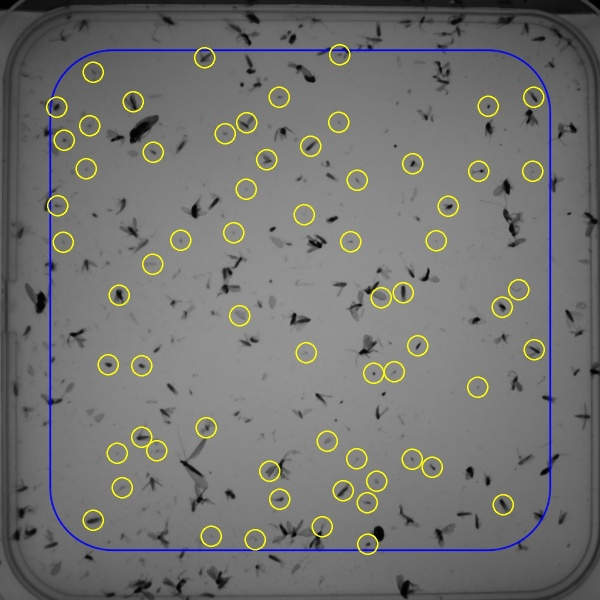

# Object Detection in a Petri Dish

This program detects insects in a petri dish using *OpenCV*. The size of the insects is within a given range and the distance between two insects must be greater than a given value. The petri dish has an area of *12 x 12 millimeters*, and the parameters for the minimum distance between two insects and the specific size can be set. The coordinates are stored in a list, which are used to move the pipette to these positions. A camera from ximea is used for photography, and different types can be used. In this Petri dish, 65 insects that met the conditions were detected.  

